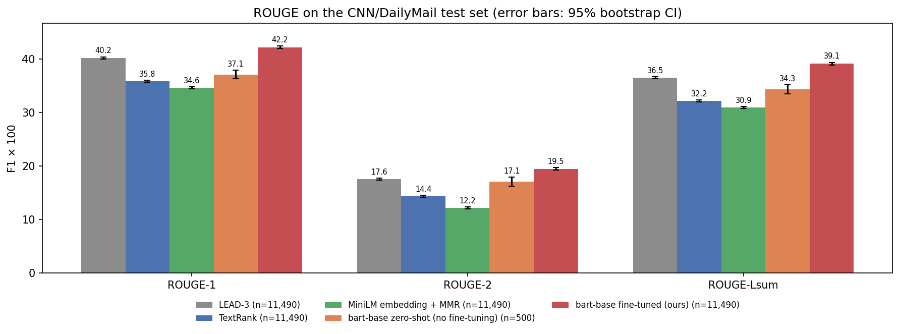
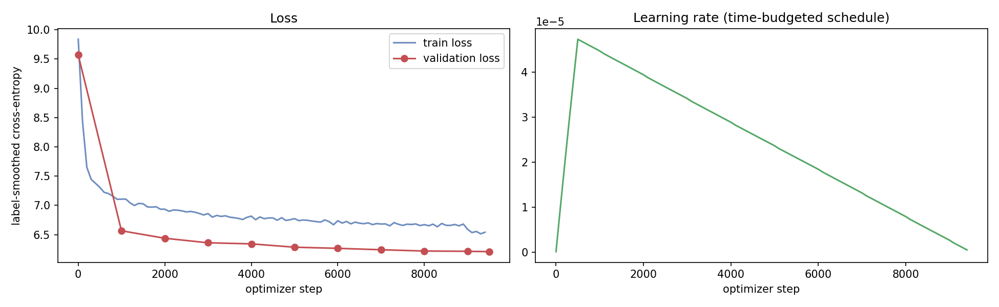
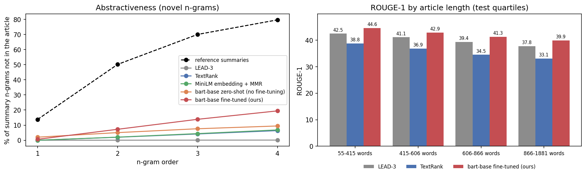
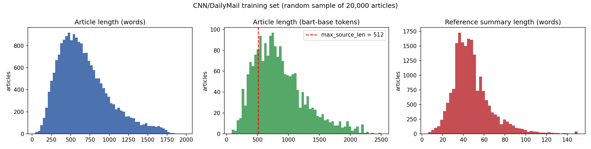

# Text Summarization with Transformers (CNN/DailyMail)

Deep Learning course project — **abstractive and extractive summarization of news articles and research papers**.
A pre-trained encoder–decoder transformer (**BART-base**) is fine-tuned on the CNN/DailyMail corpus and compared with
three extractive baselines (LEAD-3, TextRank, transformer-embedding MMR). Documents longer than the model's input
window (e.g. research papers) are handled by hierarchical *map-reduce* summarization.

**Author:** Kumar Sidharth · B.Tech CSE, BIT Mesra · [github.com/ksidharth8](https://github.com/ksidharth8)

**Dataset:** [Kaggle – newspaper-text-summarization-cnn-dailymail](https://www.kaggle.com/datasets/gowrishankarp/newspaper-text-summarization-cnn-dailymail) (CNN/DailyMail 3.0.0: ≈287k train / 13k validation / 11.5k test)

---

## Results

<!-- RESULTS:START -->
Full CNN/DailyMail test set (11,490 articles) · ROUGE F1 × 100 with Porter stemming · ± = half-width of the 95% bootstrap confidence interval.

| System | ROUGE-1 | ROUGE-2 | ROUGE-L | ROUGE-Lsum | avg. words |
|---|---|---|---|---|---|
| LEAD-3 | 40.17 ± 0.22 | 17.56 ± 0.21 | 25.09 ± 0.19 | 36.48 ± 0.21 | 77.2 |
| TextRank | 35.80 ± 0.20 | 14.36 ± 0.18 | 23.10 ± 0.16 | 32.17 ± 0.19 | 85.7 |
| MiniLM embedding + MMR | 34.57 ± 0.20 | 12.18 ± 0.18 | 21.24 ± 0.16 | 30.92 ± 0.20 | 78.5 |
| BART-base zero-shot (no fine-tuning, n = 500) | 37.09 ± 0.83 | 17.05 ± 0.87 | 23.34 ± 0.77 | 34.31 ± 0.84 | 112.5 |
| **BART-base fine-tuned (ours)** | **42.16 ± 0.23** | **19.47 ± 0.24** | **28.97 ± 0.22** | **39.13 ± 0.23** | 62.3 |
<!-- RESULTS:END -->

**ROUGE-Lsum** is the summary-level ROUGE-L that papers report as "ROUGE-L" on CNN/DailyMail; plain ROUGE-L treats the whole summary as one sequence and is always lower. Every number, confidence interval, significance test and the full training log are in [`results/metrics.json`](results/metrics.json); outputs for texts outside the dataset are in [`results/custom_cases.md`](results/custom_cases.md).



**Comparison with published results** (ROUGE-1 / 2 / L, where L is summary-level):

| Model | Type | R-1 | R-2 | R-L |
|---|---|---|---|---|
| LEAD-3 (See et al., 2017) | extractive baseline | 40.34 | 17.70 | 36.57 |
| LEAD-3 (ours) | extractive baseline | 40.17 | 17.56 | 36.48 |
| Pointer-Generator + coverage (See et al., 2017) | abstractive (RNN) | 39.53 | 17.28 | 36.38 |
| BertSumExtAbs (Liu & Lapata, 2019) | abstractive | 42.13 | 19.60 | 39.18 |
| **BART-base fine-tuned (ours)** | abstractive | **42.16** | **19.47** | **39.13** |
| MatchSum (Zhong et al., 2020) | extractive | 44.41 | 20.86 | 40.55 |
| T5-11B (Raffel et al., 2020) | abstractive | 43.52 | 21.55 | 40.69 |
| BART-large (Lewis et al., 2020) | abstractive | 44.16 | 21.28 | 40.90 |
| PEGASUS-large (Zhang et al., 2020) | abstractive | 44.17 | 21.47 | 41.11 |

Our LEAD-3 is within 0.2 points of the published LEAD-3, so the evaluation setup is comparable. With ≈140 M parameters, a 512-token input and about one epoch of training on free GPUs, BART-base reaches the level of BertSumExtAbs and beats the Pointer-Generator by 2.6 ROUGE-1; it stays 2.0 points below BART-large (≈400 M parameters, 1,024-token input).

### What the results show

- **Fine-tuning gives a significant gain over the strongest baseline.** Paired bootstrap on all 11,490 test articles, fine-tuned minus LEAD-3: ROUGE-1 +1.99 (95% CI +1.79 to +2.19), ROUGE-2 +1.90 (95% CI +1.71 to +2.12), ROUGE-Lsum +2.65 (95% CI +2.44 to +2.84). None of the 1,000 resamples favoured LEAD-3 (p < 0.001).
- **The pre-trained model alone is not a summarizer.** On the same 500 articles, zero-shot BART-base scores 37.09 ROUGE-1 against 41.22 after fine-tuning and 40.10 for LEAD-3. It was only trained to reconstruct text, so it copies the start of the article (112.5 words, 5.25 sentences on average); fine-tuning teaches it to select and compress (62.3 words).
- **News has a strong lead bias.** LEAD-3 beats both unsupervised extractive methods by 4.4–5.6 ROUGE-1. TextRank (centrality) and the embedding method (similarity to the whole article) pick sentences from anywhere, while CNN/DailyMail highlights mostly come from the opening paragraphs.
- **The model is mostly extractive.** 7.25% of its bigrams and 19.44% of its 4-grams do not occur in the article, versus 50.21% and 79.72% for the human highlights: it shortens and merges source sentences rather than paraphrasing.
- **Longer articles are harder for every system.** ROUGE-1 drops from 44.57 (shortest quartile, 55-415 words) to 39.91 (longest, 866-1881 words). LEAD-3, which never reads past sentence 3, drops by a similar amount (42.46 → 37.75), so this reflects harder articles rather than the 512-token truncation alone; the advantage over LEAD-3 stays at about +2 in every quartile (+2.11, +1.76, +1.93, +2.16).
- **Training and cost.** The 4.5 h time budget ended training at step 9,496 of 26,919 planned (1.058 epochs, 303,872 articles, 18.76 articles/s on 2 × T4); the learning rate had annealed to ≈0 as designed. Validation loss (label-smoothed) fell from 9.57 to 6.57 in the first 1,000 steps and only to 6.21 by the end, so extra epochs would add little. Summarizing the test set took 43 min (4.42 articles/s, 4 beams, one T4); the whole notebook ran in 5.62 h.





### Texts outside the dataset

On the four original test texts in `test_cases/` ([outputs](results/custom_cases.md)), the summaries are fluent and every statement is supported by the source, but the model keeps the news habit of building the summary from the opening sentences, trimming clauses such as "officials said on Monday". Two weaknesses are visible. For the flood-warning article it skipped the key first sentence (what the system does). For the 838-word paper (3 chunks in long-document mode), the final summary kept the title, motivation and conclusion but dropped the latency results that the first chunk summary contained.

---

## Repository structure

```
text-summarization-transformers/
├── notebooks/
│   ├── 01_train_bart_cnn_dailymail.ipynb   # Kaggle: data → baselines → fine-tuning → evaluation → model
│   └── 02_test_summarizer.ipynb            # load the trained model, test custom texts / long documents
├── src/
│   ├── preprocessing.py   # CNN/DailyMail boilerplate cleaning, sentence splitting
│   ├── extractive.py      # LEAD-k, TextRank, MiniLM-embedding + MMR
│   ├── metrics.py         # ROUGE + bootstrap CIs, paired bootstrap test, novel n-grams
│   └── summarizer.py      # inference wrapper (BART/T5/PEGASUS) + long-document map-reduce
├── scripts/
│   ├── summarize.py       # command-line summarizer
│   └── build_notebooks.py # regenerates the notebooks from src/ and test_cases/
├── app/app.py             # Gradio web demo
├── test_cases/            # 4 original texts: 2 news articles, a research abstract, a long paper (838 words)
├── tests/                 # pytest unit tests (no model download needed)
├── results/               # put metrics.json, figures, results_table.md from the Kaggle run here
├── requirements.txt
└── LICENSE
```

---

## Step 1 — Put the project on GitHub

1. On github.com → **New repository** → name `text-summarization-transformers`, *Public*, **no** README / .gitignore / license (the project already has them) → *Create*.
2. In a terminal:

```bash
unzip text-summarization-transformers.zip
cd text-summarization-transformers
git init
git add .
git commit -m "Text summarization with transformers: notebooks, src, tests, app"
git branch -M main
git remote add origin https://github.com/ksidharth8/text-summarization-transformers.git
git push -u origin main
```

GitHub asks for a **personal access token** instead of your password (Settings → Developer settings → Personal access tokens), or use `gh auth login` / SSH.
The trained model is **not** committed (≈560 MB; GitHub's file limit is 100 MB) — see Step 4.

## Step 2 — Train on Kaggle

1. **Kaggle → Create → New Notebook → File → Import Notebook** → upload `notebooks/01_train_bart_cnn_dailymail.ipynb`.
2. Right panel → **Add Input** → search `newspaper-text-summarization-cnn-dailymail` (by *gowrishankarp*) → **Add**.
3. **Settings → Accelerator → GPU T4 x2**, and **Internet → On** (both need a phone-verified Kaggle account). The internet is only used to download `facebook/bart-base` and `all-MiniLM-L6-v2` from Hugging Face.
4. **Smoke test** (≈10–15 min): keep `RUN_MODE = "smoke"` and press **Run All**. Every step runs on small subsets; the last cell prints *SMOKE RUN FINISHED*. The scores are meaningless here — the point is that nothing crashes.
5. **Full run**: change the line to `RUN_MODE = "full"` → **Save Version** → **Save & Run All (Commit)** → *Save*. It runs in the background (measured: 5.6 h in total — about 20 min data preparation and baselines, 4.5 h training, 45 min evaluation). You can close the tab; follow progress under *View Logs*.
6. When the version shows *Complete*: open it → **Output** → download
   - `bart-base-cnn-summarizer.zip` (the model),
   - `results/` (`metrics.json`, `results_table.md`, `custom_cases.md`, `test_predictions.csv`, `figures/`).

   Or with the Kaggle CLI: `kaggle kernels output <your-username>/<notebook-slug> -p kaggle_output`.

A full run uses ≈6 of the ≈30 free GPU hours per week and stays well inside the session limit.

## Step 3 — Add the results to the repo

```bash
cp -r kaggle_output/results/* results/          # metrics.json, results_table.md, custom_cases.md, figures/
# paste results/results_table.md between the RESULTS markers at the top of this README
git add results README.md && git commit -m "Add results of the full training run" && git push
```

## Step 4 — Share the model

The model folder is ≈560 MB, so publish it next to the code instead of inside git:
- **GitHub Release** (simplest): repo page → *Releases* → *Draft a new release* → tag `v1.0` → attach `bart-base-cnn-summarizer.zip` (release files may be up to 2 GB).
- **Hugging Face Hub** (optional): add a Kaggle secret `HF_TOKEN` (*Add-ons → Secrets*) and set `push_to_hub=True` in the notebook config before the full run.

## Step 5 — Test the model

**On Kaggle:** new notebook → *Add Input* → *Your Work* → select the training notebook (its whole output, including the model and `src/`, is mounted under `/kaggle/input/`) → import `notebooks/02_test_summarizer.ipynb` and *Run All*.

**Locally (CPU is fine for a few texts):**

```bash
pip install -r requirements.txt
mkdir -p models && unzip bart-base-cnn-summarizer.zip -d models/      # -> models/bart-base-cnn-summarizer/

python scripts/summarize.py --file test_cases/01_news_electric_buses.txt
python scripts/summarize.py --file test_cases/04_long_paper_token_pruning.txt   # > 512 tokens -> long-document mode
python scripts/summarize.py --text "Paste any article here ..." --method abstractive --num_beams 6

python app/app.py                       # Gradio demo at http://127.0.0.1:7860
jupyter notebook notebooks/02_test_summarizer.ipynb
```

In Python:

```python
from src.summarizer import Summarizer
s = Summarizer("models/bart-base-cnn-summarizer")
s.summarize(article)                      # one text -> summary (length adapts to short inputs)
s.summarize([a1, a2, a3], batch_size=16)  # batch
s.summarize_long(paper_text)["summary"]   # research papers / documents longer than 512 tokens
```

The saved folder is a standard Hugging Face model, so `transformers.pipeline("summarization", model="models/bart-base-cnn-summarizer")` works too.

---

## How it works

**Data.** CSVs are discovered automatically; rows with missing text or articles under 20 words are dropped. `clean_article` removes scraping boilerplate at the top of articles (`By . Daily Mail Reporter . PUBLISHED: . 14:11 EST, 25 October 2013 .`, `LONDON, England (CNN) --`, "Scroll down for video"). References are only whitespace-normalised. The notebook reports length statistics, the share of articles longer than the 512-token window, and how abstractive the reference summaries are (novel n-grams). Articles average 674 words (858 BART tokens) and 78.4% are longer than the 512-token input; the highlights average 47.9 words in 3.81 sentences (15.6× compression).



**Extractive baselines.**
- *LEAD-3* — first three sentences (news follows the inverted-pyramid style, so this is hard to beat).
- *TextRank* — PageRank (d = 0.85) on a sentence graph with edge weight |Si ∩ Sj| / (log|Si| + log|Sj|), stop-words removed; implemented from scratch in NumPy.
- *Embedding + MMR* — sentences encoded with `all-MiniLM-L6-v2` (mean pooling); relevance = cosine to the document centroid; Maximal Marginal Relevance (λ = 0.7) for diversity.

**Abstractive model.** `facebook/bart-base` (6 + 6 layers, ≈140 M parameters) fine-tuned with teacher forcing and label-smoothed cross-entropy (ε = 0.1); AdamW (lr 5e-5, weight decay 0.01, none on biases/LayerNorm), linear warm-up (500 steps), gradient clipping 1.0, fp16 mixed precision, effective batch 32 on 2 × T4 (DataParallel). Input ≤ 512 tokens, target ≤ 128 tokens.

**Time-budgeted learning-rate schedule.** Free GPU sessions are time-limited, and a plain linear schedule would leave the learning rate high if the run is cut off. Here the decay follows whichever is further along — optimizer steps or wall-clock time:

lr(s) = lr_max · min(1, (s+1)/W) · (1 − max(s/S, t/T))

(s = step, W = warm-up, S = planned steps for `epochs`, t = elapsed training time, T = `train_hours`). Training stops when either fraction reaches 1, so the run always ends inside the time limit with a fully annealed learning rate. The notebook's smoke test confirms this path (e.g. stopping at step 237 of 3,800 when the budget is reached).

**Decoding.** Beam search with 4 beams, 56–142 new tokens, length penalty 2.0, no repeated trigrams (the CNN/DailyMail settings of the BART paper). For short non-news inputs the summary length is scaled to the input length.

**Long documents (research papers).** If a text exceeds the input window, it is split into sentence-aligned chunks that fit (with one sentence of overlap), each chunk is summarized, the partial summaries are concatenated and summarized again (up to 2 rounds).

**Evaluation.** ROUGE-1/2/L/Lsum with Google's `rouge-score` (stemming, one sentence per line for Lsum), 95% bootstrap CIs (1,000 resamples), paired bootstrap tests (fine-tuned vs. each baseline), zero-shot vs. fine-tuned comparison on the same subset, ROUGE by article length (effect of truncation), abstractiveness (novel 1–4-grams), summary length, qualitative examples and the custom test cases.

## Configuration (top of the training notebook)

| Key | Default | Notes |
|---|---|---|
| `RUN_MODE` | `"smoke"` | `"full"` for the real run |
| `model_name` | `facebook/bart-base` | `facebook/bart-large` (set `per_device_batch=4`), `t5-small`, `google/flan-t5-base` also work (T5 runs in fp32) |
| `train_hours` / `epochs` | 4.5 / 3 | training ends at whichever comes first |
| `per_device_batch` / `effective_batch` | 16 / 32 | lower `per_device_batch` to 8 on CUDA out-of-memory (gradient accumulation keeps the effective batch) |
| `max_source_len` / `max_target_len` | 512 / 128 | tokens |
| `test_samples` | `None` | `None` = the full test set; a number evaluates a random subset (faster) |
| `run_embed_extractive`, `zero_shot_samples` | `True`, 500 | optional parts of the evaluation |

## Troubleshooting

| Problem | Fix |
|---|---|
| `No CSV files under '/kaggle/input'` | the dataset is not attached (Step 2.2) |
| `OSError … huggingface.co` / connection errors | Internet is off in the notebook settings (needs phone verification) |
| `No GPU visible` | Settings → Accelerator → GPU T4 x2, then run again |
| `CUDA out of memory` | `per_device_batch=8` (or 4) |
| W&B asks for an API key | the notebook disables it (`WANDB_DISABLED`, `report_to="none"`); make sure the imports cell ran |
| Session ends before the run finishes | lower `train_hours` or set `test_samples=5000` |
| Summaries of your own texts are too long / short | pass `max_new_tokens` / `min_new_tokens` (CLI: `--max_new_tokens 60`) |

## FAQ

**Why a Hugging Face folder and not a `.pkl` file?** Pickle files run arbitrary code when loaded and are tied to the exact class definitions and library versions that created them. The saved folder (`model.safetensors` + `config.json` + tokenizer + `generation_config.json` + `summarizer_config.json`) is the standard, safe and portable format. It loads with one line in any recent `transformers` version, on CPU or GPU, in Python, in `pipeline(...)`, or from the Hub.

**Why does the notebook contain the `src/` code?** Kaggle runs a single notebook. The `%%writefile` cells write the package into the output, so the model and the code that uses it are downloaded together. `scripts/build_notebooks.py` regenerates the notebooks from `src/`, so the two never drift apart.

**Is the abstractive summary always correct?** No. Abstractive models can state facts that are not in the article (hallucination; Maynez et al., 2020). The notebook reports the novel n-gram rate as a rough indicator; always check numbers and names against the source.

## Development

```bash
pytest -q                            # unit tests (cleaning, TextRank, MMR, ROUGE, bootstrap, chunking)
python scripts/build_notebooks.py    # after editing src/ or test_cases/
```

The full pipeline ran on Kaggle (2 × Tesla T4, Python 3.12, torch 2.10, transformers 5.0.0, datasets 5.0.0) in 5.62 h; the notebooks are also tested end-to-end on CPU with tiny stand-in models (transformers 5.17). Version differences are handled in the notebook (`eval_strategy`/`evaluation_strategy`, `processing_class`/`tokenizer`), so transformers ≥ 4.46 should work as well.

## References

- Hermann et al. (2015). Teaching Machines to Read and Comprehend. *NeurIPS*.
- Nallapati et al. (2016). Abstractive Text Summarization using Sequence-to-sequence RNNs and Beyond. *CoNLL*.
- See, Liu & Manning (2017). Get To The Point: Summarization with Pointer-Generator Networks. *ACL*.
- Vaswani et al. (2017). Attention Is All You Need. *NeurIPS*.
- Lewis et al. (2020). BART: Denoising Sequence-to-Sequence Pre-training for Natural Language Generation, Translation, and Comprehension. *ACL*.
- Raffel et al. (2020). Exploring the Limits of Transfer Learning with a Unified Text-to-Text Transformer. *JMLR*.
- Zhang et al. (2020). PEGASUS: Pre-training with Extracted Gap-sentences for Abstractive Summarization. *ICML*.
- Liu & Lapata (2019). Text Summarization with Pretrained Encoders. *EMNLP*.
- Zhong et al. (2020). Extractive Summarization as Text Matching. *ACL*.
- Mihalcea & Tarau (2004). TextRank: Bringing Order into Text. *EMNLP*.
- Carbonell & Goldstein (1998). The Use of MMR, Diversity-Based Reranking for Reordering Documents and Producing Summaries. *SIGIR*.
- Reimers & Gurevych (2019). Sentence-BERT: Sentence Embeddings using Siamese BERT-Networks. *EMNLP*.
- Lin (2004). ROUGE: A Package for Automatic Evaluation of Summaries. *ACL Workshop*.
- Loshchilov & Hutter (2019). Decoupled Weight Decay Regularization. *ICLR*.
- Maynez et al. (2020). On Faithfulness and Factuality in Abstractive Summarization. *ACL*.
- Wolf et al. (2020). Transformers: State-of-the-Art Natural Language Processing. *EMNLP (Demos)*.

## License

MIT — see [LICENSE](LICENSE). The fine-tuned weights derive from `facebook/bart-base` (Apache-2.0); CNN/DailyMail is for research use.
